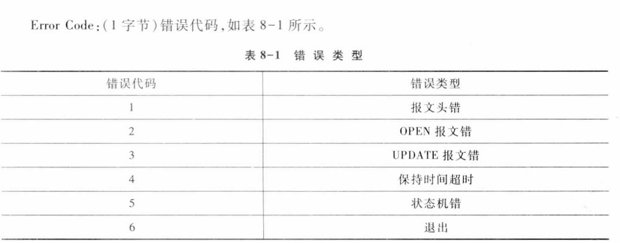
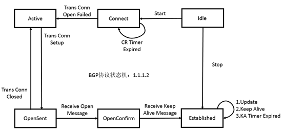

# 计算机网络实验复习

## 注意事项

1. tracert看不见

   > ip ttl-expires enable
   > ip unreachables enable  

   可用 tracert –d 10.1.3.10，避免DNS配置的干扰。

2.undo inter vlan 1

这些出厂设置，会造成地址冲突、自动参加ospf的router id 选举，造成router id冲突等等。目前已发现其有可能会对**OSPF、BGP、组播、IPv6等实验造成不良影响，且故障隐蔽不易排查。**

建议养成习惯，实验开始时，undo这些出厂设置。

例如：

1）线下实验环境的路由器会自带interface vlan 1（ip address 192.168.0.1）

​    解决办法：[h3c]undo  interface vlan 1

2）线上平台部分路由器的Ethernet0/0接口会自带ip address 192.168.1.1

​    解决办法：[h3c-Ethernet0/0]undo ip address 

3）部分交换机的出厂设置创建了三层接口interface vlan-interface 1，并配置了dhcp自动获取地址。

​    解决办法：[h3c]undo  interface vlan 1

3. 查看端口状态及简写

   > dis inter brief

4. 关掉XGE 1/0/25 to XGE1/0/28

5. **ARP**

   > [S1]undo mac-addr  
   > <S1> reset arp all    
   >
   > PC:arp -d   <!--若不成功管理员权限-->

## 常用快捷方式

（1）<Ctrl+G>对应命令display current-configuration（显示当前配置）

（2）<Ctrl+L>对应命令display ip routing-table（显示IPv4 路由表信息）

（3）<Ctrl+O>对应命令undo debugging all（关闭设备支持的所有功能项的调试开关）

（4）<Ctrl+Z> 对应命令return（退回到用户视图）

## 常用配置命令

### 1.  重启

> <h3c> reset sa  
> <h3c> y  
> <h3c> reboot  
> <h3c> n  
> <h3c> y
>
> reset saved-configuration  
> reset arp all  
> reset ospf process  
> reset bgp all  
> reboot   

### 2. dispay

可在任意视图下使用。

> dis cur 
> dis version
> dis inter e1/0/1
>
> <!--查看交换机的MAC地址表-->
>
> dis mac-addr 
>
> display ip routing-table  
> display ospf routing-table  
> display bgp routing-table ipv4  
> display pim routing-table  
> display ipv6 routing-table   

### 3. 路由器基本配置

1. **基本配置**

   > <h3c>sys  
   > [h3c]dis version

2. **接口配置**

   > sys
   > inter G0/0
   >
   > <!--设置网络协议地址 -->
   >
   > ip addr 192.168.0.1 24      <!--掩码24位 -->
   >
   > <!--取消网络协议地址 -->
   > undo ip addr 192.168.0.1 24      <!--掩码24位 -->

### 4. 交换机基本配置

1. **进入以太网端口**

   > sys  
   > inter G1/0/1

2. **打开关闭以太网端口**

   > shutdown  
   > undo shutdown

3. **设置以太网端口类型**

   端口视图下，默认access。

   > port link-type access/hybrid/trunk  
   > undo port link-type

4. **mac地址表**

   > display mac-address   
   > undo mac-address *# 交换机清空 MAC 地址表*

### 5. win配置电脑的ip地址

>netsh interface ip set address name="本地连接" static 192.168.2.10 255.255.255.0 192.168.2.1 0 
>
>arp-d *# 计算机清空 ARP 缓存*

## 集线器、交换机、路由器

1. 集线器(Hub): 工作在物理层，主要功能是对端口接收到的电信号进行复制、整形、放大，同时有多个端口传输数据会发生冲突
2. 交换机(Switch): 工作在数据链路层，每个冲突域只有一个端口，交换机基于MAC地址表决定数据的转发端口，而不是向所有端口转发。
3. 路由器(Router): 工作在网络层，根据数据包的IP地址选择发送路径，转发数据包到相应网络，一般工作在广域网，具有两个以上的端口，分别连接不同的网络。路由器隔离广播域。

## VLAN的配置与分析

VLAN技术是一种专门为隔离二层广播报文设计的虚拟局域网技术。

路由器隔离广播域，是因为路由器的数据转发都在IP层进行，所以对于二层本地广播来说，它是无法通过路由器的。

VLAN技术中，规定凡是具有VLAN功能的交换机在转发数据报文时，都需要确认该报文属于某一个VLAN，并且该报文只能被转发到属于同一VLAN的端口或主机。每一VLAN代表一个广播域，不同的VLAN用户属于不同的广播域，他不能接受来自不同VLAN用户的广播报文。

###  VLAN的帧格式

IEEE802.1Q协议规定VLAN技术，在原有标准以太网帧格式中添加一个特殊标志域tag，用于标识数据帧所属的VLANID。

### VLAN数据帧的传输、VLAN端口的分类P50

### VLAN的配置

1. **创建/删除VLAN**

   > vlan 2
   > undo vlan 2

2. **向当前VLAN添加/删除端口**

   > vlan 2  
   > port G1/0/2 G1/0/1  
   > port G1/0/3 to G1/0/20

3. **指定端口类型**

   > inter G1/0/1
   > port link-type trunk
   > port link-type hybrid
   > undo port link-type

4. **指定/删除端口的默认vlanID**

   > inter G1/0/1
   > port trunk pvid vlan 2
   > undo port trunk pvid 2

5. **指定/删除Trunk端口可以通过的VLAN数据帧**

   > inter G1/0/1
   > port trunk permit vlan 2 to 3
   > port trunk permit vlan 3
   > port trunk permit vlan all

6. **将Hybrid端口加入到指定的已经存在的VLAN，并标记为tagged或untagged**

   > inter G1/0/1
   > port hybrid vlan 20 30 untagged

### exp1 网络实验入门P28

<!--wrong-->

**netsh interface set ip address name="本地连接" static 192.168.2.10 255.255.255.0 192.168.2.1 0**

**netsh interface set ip address name="本地连接" static 192.168.2.11 255.255.255.0 192.168.2.1 0**

**netsh interface set ip address name="本地连接" static 192.168.3.10 255.255.255.0 192.168.3.1 0**

**netsh interface set ip address name="本地连接" static 192.168.3.11 255.255.255.0 192.168.3.1 0**

true : netsh interface ip set address 

**R1**
sys
sysname R1
inter G0/0 
ip addr 192.168.2.1 24
inter G0/1
ip addr 192.168.3.1 24

### exp2 数据链路层

IEEE802.3标准

1. 交换机的MAC地址表：交换机的转发基于MAC地址表，MAC地址表是交换机在收到帧时通过学习帧中的源地址和来源帧端口生成。

2. 交换机的端口聚合

3. 实验配置：

   > netsh interface ip set address name="本地连接" static 192.168.2.10 255.255.255.0 192.168.2.1 0
   > netsh interface ip set address name="本地连接" static 192.168.2.11 255.255.255.0 192.168.2.1 0
   > netsh interface ip set address name="本地连接" static 192.168.2.12 255.255.255.0 192.168.2.1 0
   > netsh interface ip set address name="本地连接" static 192.168.2.12 255.255.255.0 192.168.2.1 0

   **S1**
   sys
   sysname S1
   vlan 2
   port G1/0/1 to G1/0/5
   vlan 3
   port G1/0/20 to G1/0/24

4. 实验配置2

   netsh interface ip set address name="本地连接" static 192.168.2.10 255.255.255.0
   **S1**
   vlan 2
   port G1/0/1 to G1/0/5
   vlan 3
   port G1/0/20 to G1/0/24
   inter G1/0/13
   port link-type trunk

   **permit vlan 2 3**

   port trunk permit vlan 2 3

   undo port link-type
   port link-type hybrid
   **port hybrid pvid vlan 1**
   **port hybrid vlan 2 tagged**
   **port hybrid vlan 3 untagged**
   **port hybrid vlan 3 tagged**
   or
   port hybrid pvid vlan 3

   **S2**
   vlan 2
   port G1/0/1 to G1/0/5
   vlan 3
   port G1/0/20 to G1/0/24
   inter G1/0/13
   port link-type trunk
   port trunk permit vlan 2 3

### 广域网数据链路层协议

#### 1.PPP

LCP状态转移图

广域网中广泛使用的数据链路层协议

两种身份认证：PAP,CHAP

#### 2.实验步骤

##### PPP

R1-R2串接

**R1&R2**

inter S1/0
ip addr 192.0.0.1 24

link-protocol ppp

<!--配置完成后需要重新启动该接口使之生效-->

shutdown
undo shutdown

ctrl+z
<R1>

debugging ppp all
terminal debugging

**R2**

inter Ser2/0
shutdown
inter Ser1/0
shutdown
undo shutdown

##### **PAP**

**[R1]主**

local-user RTB class network
service-type ppp
password simple aaa
inter Ser1/0
ppp authentication-mode pap

**[R2]从**

inter Ser1/0
ppp pap local-user RTB password simple aaa

配置PPP后重新启动接口生效

通过display interface serial命令，查看接口Serial2/1/0的信息，发现接口的物理层和链路层的状态都是up状态，并且PPP的LCP和IPCP都是opened状态，说明链路的PPP协商已经成功

inter S1/0
shutdown
undo shutdown

<R1>

debugging ppp pap all
terminal debugging
[R1]inter Ser1/0
shut down
undo shutdown

testping debugging

##### CHAP

**[R1]主用户名RTA**

local-user RTB class network
service-type ppp
password simple aaa
inter S0/0
ppp authentication-mode chap
ppp chap user RTA

**[R2]从用户名RTB**

local-user RTA class network
service-type ppp
password simple aaa
inter S0/0
ppp chap user RTB

配置完后需要在接口上shutdown和undo shutdown

inter S0/0
shutdown
undo shutdown

<R1>

debugging ppp chap all
terminal debugging
[R1]
inter S0/0
shutdown
undo shutdown

### VLAN间通信P.84

**netsh interface ip set address name="本地连接" 192.168.2.10 255.255.255.0 192.168.2.1 0**

netsh interface ip set address name="本地连接" static 192.168.2.10 255.255.255.0 192.168.2.1 0

netsh interface ip set address name="本地连接" static 192.168.3.10 255.255.255.0 192.168.3.1 0

**[S1]**

undo inter vlan 1
vlan 2
port G1/0/1 to G1/0/4
vlan 3 
port G1/0/20 to G1/0/24
inter G1/0/13
port link-type trunk
port trunk permit vlan 2 3
inter vlan 2
ip addr 192.168.2.1 24
inter vlan 3
ip addr 192.168.3.1 24

**[S2]**

undo inter vlan 1
vlan 2
port G1/0/1 to G1/0/4
vlan 3 
port G1/0/20 to G1/0/24
inter G1/0/13
port link-type trunk
port trunk permit vlan 2 3

清空交换机的MAC地址表和arp缓存

[S1]undo mac-addr
<s1>reset arp all

PC:

arp -d

#####  **交换机MAC地址表说明**

以VLAN Trunk实验的交换机S1为例，显示其MAC地址表，通常里面有3部分MAC地址：

（1） PC的MAC地址，在PC上用ipconfig/all查看

（2）对端交换机S2的MAC地址，在S2上用display interface命令查看

（3）连线组网设备的MAC地址，我们没有权限查看，大家知道就好。

## OSPF

### 报文类型

1. **Hello报文**：周期性发送，用来发现和维持OSPF邻居关系，以及进行DR（Designated Router，指定路由器）/BDR（Backup Designated Router，备份指定路由器）的选举。
2. **DD**（Database Description，数据库描述）报文：描述了本地LSDB（Link State DataBase，链路状态数据库）中每一条LSA（Link State Advertisement，链路状态通告）的摘要信息，用于两台路由器进行数据库同步。
3. **LSR**（Link State Request，链路状态请求）报文：向对方请求所需的LSA。两台路由器互相交换DD报文之后，得知对端的路由器有哪些LSA是本地的LSDB所缺少的，这时需要发送LSR报文向对方请求所需的LSA。
4. **LSU**（Link State Update，链路状态更新）报文：向对方发送其所需要的LSA。
5. **LSAck**（Link State Acknowledgment，链路状态确认）报文：用来对收到的LSA进行确认。

### LSA类型

1) **第一类 LSA : Router** 

   描述本路由器运行OSPF的接口的连接状况、花费等信息。传递范围在所属区域内。（描述DRother到DR的连接） 

2) **第二类 LSA : Network(Net)** 

   DR 生成。描述网段内所有已经同其建立了邻接关系的路由器。传递范围在所属区域内。（描述网段内的路由器信息） 

3) **第三类 LSA : Summary Network(SumNet)** 

   ABR 生成。ABR 完成它所属区域中的区域内路由计算后，将本区 域内的每一条OSPF路由封装发送到相邻区域。传递范围是除了第三类 LSA生成的区域之外的其他区域。（描述网段内的OSPF路由信息） 

4) **第四类 LSA : Asbr-Summary(SumASB)** 

   ABR 生成。描述本区域内部到达 ASBR 的路由。传递范围为第四 LSA生成的区域之外的其他区域(描述到达ASBR的路由信息)

5) **第五类 LSA : AS-External(ASE)**

    ASBR 生成。描述道自治系统外部路由信息。传递范围为整个自治系统(除Stub区域)。

​	**骨干区域**： 即 area 0，要求其他所有的区域必须和骨干区域相连，并且骨干区域 自身也必须是连通的。所有ABR将自身区域内路由信息收集完成后生成第三 类LSA统一发送给骨干区域，再通过骨干区域将这些信息转发给其他非骨干 区域。可以有效地避免产生区域间路由回环。

### 路由器的类型

1. **区域内路由器（Internal Router）**

​	该类路由器的所有接口都属于同一个OSPF区域。

2. **区域边界路由器ABR(Area Border Router)**

   该类路由器可以同时属于两个以上的区域，但其中一个必须是骨干区域。ABR用来连接骨干区域和非骨干区域，它与骨干区域之间既可以是物理连接，也可以是逻辑上的连接。

3. **骨干路由器（Backbone Router）**

   该类路由器至少有一个接口属于骨干区域。因此，所有的ABR和位于Area0的内部路由器都是骨干路由器。

4. **自治系统边界路由器ASBR(AS Boundary Router)**

   与其他AS交换路由信息的路由器称为ASBR。ASBR并不一定位于AS的边界，它有可能是区域内路由器，也有可能是ABR。只要一台OSPF路由器引入了外部路由的信息，它就成为ASBR。

	在OSPF中，邻居（Neighbor）和邻接（Adjacency)是两个不同的概念。路由器启动后，会通过接口向外发送Hello报文，收到Hello报文的路由器会检查报文中所定义的参数，如果双方一致就会形成邻居关系。只有当双方成功交换DD报文，交换LSA并达到LSDB同步之后，才形成邻接关系。

### DR/BDR选举过程

​	DR/BDR是由同一网段中所有的路由器根据路由器优先级和Router ID通过Hello报文选举出来的，只有优先级大于0的路由器才具有选举资格。

​	进行DR/BDR选举时每台路由器将自己选出的DR写入Hello报文中，发给网段上每台运行OSPF协议的路由器。当处于同一网段的两台路由器同时宣布自己是DR时，路由器优先级高者胜出。如果优先级相等，则Router ID大者胜出。

**可靠**

从Router重复主Router的seq,主Router seq+1表示ACK上一条DD

### 报文交互过程

**需要注意的是：**

+ 只有在广播或NBMA网络中才会选举DR；在P2P或P2MP网络中不需要选举DR。

+ DR是某个网段中的概念，是针对路由器的接口而言的。某台路由器在一个接口上可能是DR，在另一个接口上有可能是BDR，或者是DR Other。

+ DR/BDR选举完毕后，即使网络中加入一台具有更高优先级的路由器，也不会重新进行选举，替换该网段中已经存在的DR/BDR成为新DR/BDR。DR并不一定就是路由器优先级最高的路由器接口；同理，BDR也并不一定就是路由器优先级次高的路由器接口。

### 网络类型

### OSPF的网络类型

#### 根据链路层协议类型将网络分为下列四种类型：

+ **广播（Broadcast）类型：**当链路层协议是Ethernet、FDDI时，缺省情况下，OSPF认为网络类型是Broadcast。在该类型的网络中，通常以组播形式（OSPF路由器的预留IP组播地址是224.0.0.5；OSPF DR/BDR的预留IP组播地址是224.0.0.6）发送Hello报文、LSU报文和LSAck报文；以单播形式发送DD报文和LSR报文。

+  **NBMA（Non-Broadcast Multi-Access，非广播多路访问）类型：**当链路层协议是帧中继、ATM或X.25时，缺省情况下，OSPF认为网络类型是NBMA。在该类型的网络中，以单播形式发送协议报文。

+ **P2MP（Point-to-MultiPoint，点到多点）类型：**没有一种链路层协议会被缺省的认为是P2MP类型。P2MP必须是由其他的网络类型强制更改的，常用做法是将NBMA网络改为P2MP网络。在该类型的网络中，缺省情况下，以组播形式（224.0.0.5）发送协议报文。可以根据用户需要，以单播形式发送协议报文。

+ **P2P（Point-to-Point，点到点）类型：**当链路层协议是PPP、HDLC时，缺省情况下，OSPF认为网络类型是P2P。在该类型的网络中，以组播形式（224.0.0.5）发送协议报文。

**NBMA与P2MP网络之间的区别如下：**

+ NBMA网络是全连通的；P2MP网络并不需要一定是全连通的。

+ NBMA网络中需要选举DR与BDR；P2MP网络中没有DR与BDR。

+ NBMA网络采用单播发送报文，需要手工配置邻居；P2MP网络采用组播方式发送报文，通过配置也可以采用单播发送报文。

#### 将路由器周边的网络拓扑结构抽象为网络模型

Stub net：末端，网络中无其他OSPF设备，只有PC

PPP网络：点到点连接另一台OSPF路由器

点到多点网络：通过一个网络（抽象成一点）连接多个OSPF路由器，但这些路由器彼此之间并非全连通

全连接网络（Transnet）：N个路由器全连接，第二类LSA，选举DR,BDR

### 状态机

维护邻居的状态机而非自身的

### 基本配置命令

**重启**

若改变router id必须重启

reset ospf process

**查看邻居**

<!-- 详细verbose-->

dis ospf peer verbose

<!--简短-->

dis ospf peer

查看路由，**可以看到网络类型**

dis ospf rou

**\# 查看Switch D的ABR/ASBR信息。**

<SwitchD> display ospf abr-asbr

> reset ospf all （用户视图）重新启动OSPF进程
> display ospf peer 显示 OSPF 邻居信息
> display ospf brief 显示 OSPF 的概要信息
> display ospf error 显示 OSPF 错误信息
> display ospf routing 显示 OSPF 路由表的信息
> display ospf lsdb 显示 OSPF LSA 的信息
>
> router1类/network2类/summary3类/asbr4类/ase5类

**调试**

> debugging ospf event
> terminal debugging
>
> 断开S1与S1,R1,R2的连线，根据DEBUG信息画出邻居状态转移图

**引入**

> [R1-OSPF-1]
>
> import route direct  
> import route-static
>
> <!---引入默认路由-->
>
> route-default-advertise cost 100

### exp 1 P180 图7-2 

**[R1]**

undo inter vlan 1
inter G0/0
undo ip addr
ip addr 168.1.1.1 24
inter Loopback1
ip addr 1.1.1.1 32

<!--wrong-->

**ospf**
**router id 1.1.1.1**

**[R1]**
router id 1.1.1.1
ospf
area 0
network 1.1.1.0 0.0.0.255
network 168.1.1.0 0.0.0.255

**[R2]**

undo inter vlan 1
inter G0/0
undo ip addr
ip addr 168.1.1.2 24

router id 2.2.2.2
ospf
area 0
network 2.2.2.0 0.0.255
network 168.1.1.0 0.0.0.255

**[R1]**

undo router id 
router id 3.3.3.3
ospf
area 0
network 1.1.1.0 0.0.0.255
network 168.1.1.0 0.0.0.255

更改router id后需要重启ospf协议

dis ospf 

**<R1>**
debugging ospf event
terminal debugging

### exp 2 P.196

**[S1]**
undo inter vlan 1
vlan 1
port G1/0/1 to G1/0/20
inter vlan 1 
ip addr 168.1.1.3 24
inter Loopback 1
ip addr 5.5.5.5 32

router id 5.5.5.5
ospf
area 0
network 168.1.1.0 0.0.0.255
network 5.5.5.0 0.0.0.255

**[S2]**
undo inter vlan 1
vlan 1
port G1/0/1
inter vlan 1
ip addr 168.1.1.4 24
inter Loopback 1
ip addr 6.6.6.6 32

router id 6.6.6.6
ospf
area 0
network 168.1.1.0 0.0.0.255
network 6.6.6.0 0.0.0.255

**[R1]**
undo inter vlan 1
inter G0/0
undo ip addr
inter G0/0
ip addr 168.1.1.1 24
inter Loopback 1
ip addr 1.1.1.1 32

router id 1.1.1.1
ospf
area 0
network 168.1.1.0 0.0.255
network 1.1.1.0 0.0.0.255

**[R2]**
undo inter vlan 1
inter vlan 1
undo ip addr
inter G0/0
ip addr 168.1.1.2 24
inter Loopback 1
ip addr 2.2.2.2 32

router id 2.2.2.2
ospf
area 0
network 168.1.1.0 0.0.0.255
network 2.2.2.0 0.0.0.255

**显示lsdb**

display ospf lsdb brief
display ospf lsdb network/nssa/router/summary

reset ospf process

**<R1>**
debugging ospf event
terminal debugging

### exp 3 P215

**[S1]**
undo inter vlan 1
vlan 2
port G1/0/1
inter vlan 2
ip addr 192.168.1.1 24
inter Loopback 1
ip addr 4.4.4.4 32

**[S2]**
undo inter vlan 1
vlan 5
port G1/0/1
inter vlan 5
ip addr 20.1.1.2 24
inter loop 1
ip addr 6.6.6.6 32

router id 3.3.3.3
ospf
area 1
network 6.6.6.0 0.0.0.255
network 20.1.1.0 0.0.0.255

**[R2]**
undo inter vlan 1
inter G0/0
undo ip addr
inter G0/0
ip addr 20.1.1.1 24
inter S1/0
ip addr 10.1.1.2 24

**shutdown**
**undo shutdown**

router id 2.2.2.2
ospf
area 1
network 20.1.1.0 0.0.0.255
area 0
network 10.1.1.0 0.0.0.255

**[R1]**

undo inter vlan 1
inter G0/0
ip addr 192.168.1.2 24
inter S1/0
ip addr 10.1.1.1 24

<!--y??-->

**shutdown**
**undo shutdown**
inter loop 1
ip addr 5.5.5.5 32

router id 1.1.1.1
area 0
network 5.5.5.0 0.0.0.255
network 10.1.1.0 0.0.0.255

ping通

[R1]
ip route-static 4.4.4.0 24 192.168.1.1
ospf
import route-static

[S1]ip rou 0.0.0.0 0.0.0.0 192.168.1.1

dis ospf lsdb asbr
dis ospf lsdb ase

### exp 4 图7-22  P215

**ospf cost** 
**[S1]**
inter vlan 3
ospf cost 100
inter vlan 2
ospf cost 200

**[R1]**
inter G0/0
ospf cost 100
inter S1/0
ospf cost 500

SPF计算
查看router lsdb
dis ospf lsdb router

同一个OSPF区域内每台路由器上LSDB中的LSA信息一致

根据显示画图P220？？

SPF的计算

### 设计实验P227

#### 设计exp 1 图7-30 P 227

PCA
netsh interface ip set address name="本地连接" static 192.168.5.2 255.255.255.0 192.168.5.1 0

[S1]
undo inter vlan 1
vlan 1
port G1/0/1 to G1/0/5
vlan 2
port G1/0/20 to G1/0/24
inter vlan 1
ip addr 192.168.3.2 24
inter vlan 2
ip addr 192.168.5.1 24

router id 1.1.1.1
ospf
area 1
network 192.168.3.0 0.0.0.255

pc1一开始就能Ping通所有的设备只是ping不通PC2以及192.168.6.1？

方案一
S1
import direct
S2
import direct

方案二
**R1**
ip route-static 192.168.5.0 24 192.168.3.2 
ospf
import route-static

**R2**
ip route-static 192.168.6.0 24 192.168.4.2
ospf
import route-static

方案三纯静态
**S1**
ip route-static 192.168.6.0 24 192.168.3.1

**S2**
ip route-static 192.168.5.0 24 192.168.4.1

**R1**
ip route-static 192.168.5.0 24 192.168.3.2

**R2**
ip route-static 192.168.6.0 24 192.168.4.2

#### 设计exp2 图7-31 P 228

**[S1]**

router id 1.1.1.1
ospf
area 0

<!--注入的是网段.0即可不需要精确到网段号码-->

network 192.168.3.0 0.0.0.255
network 192.168.4.0 0.0.0.255
import direct

inter vlan 1
ospf cost 100
inter vlan 3
ospf cost 200

**[S2]**

ip route-static 192.168.5.0 24 202.112.1.1
ip route-static 192.168.6.0 24 202.112.2.1

**[R1]**

ip route-static 211.100.2.0 24 202.112.1.2
import route-static

router id 2.2.2.2
ospf
area 0 
network 192.168.0.0 0.0.0.255
network 192.168.3.0 0.0.0.255

inter G0/1
ospf cost100
inter S0/0
ospf cost 200

**[R2]**

ip route-static 211.100.2.0 24 202.112.2.2
import route-static

router id 3.3.3.3
ospf
area 0
network 192.168.0.0 0.0.0.255
network 192.168.4.0 0.0.0.255

inter G0/1
ospf cost 200
inter S0/0
ospf cost 200

## BGP P 230

### BGP的报文类型

1. **Open**：BGP对等体之间通过发送OPEN交换版本，AS号、保持时间、BGP 标识符等信息进行协商。 
2. **KeepAlive**：BGP 对等体间周期性发送，以确保连接有效。
3. **Update**：携带路由更新信息，包括撤销路由信息和可达路由信息及其路径属性。
4. **Notification**：BGP 检测到差错时关闭同对等体的连接。

### BGP路由发布规则

BGP发布路由时采用如下策略：

1. 存在多条有效路由时，BGP发言者只将最优路由发布给对等体。如果配置了advertise-rib-active命令，则BGP发布IP路由表中的最优路由；否则，发布BGP路由表中的最优路由。

2. BGP发言者只把自己使用的路由发布给对等体。
3. BGP发言者会将从EBGP获得的路由发布给它的所有BGP对等体（包括EBGP对等体和IBGP对等体）。
4. BGP发言者会将从IBGP获得的路由发布给它的EBGP对等体，但不会发布给它的IBGP对等体。
5. 会话一旦建立，BGP发言者将把满足上述条件的所有BGP路由发布给新对等体。之后，BGP发言者只在路由变化时，向对等体发布更新的路由

### BGP状态机

### 基本配置

1. **组网配置，不要忘了addr family ipv4**

   > bgp 300  
   > peer 1.1.1.1 as-number 100  
   > peer 3.1.1.2 as-number 300  
   > address-family ipv4  
   > peer 1.1.1.1 enable  
   > peer 3.1.1.2 enable  
   > peer 3.1.1.2 next-hop-local

2. **debug**

   > <R1>debugging bgp event  
   >  <R1>terminal debugging  
   >  <R1>reset bgp all

3. **reset bgp all**

### exp 1 BGP的基本分析 图8-5 P236

**[R1]**
undo inter vlan 1
inter G0/0
undo ip addr
ip addr 1.1.1.1 16
inter loop 1
ip addr 5.5.5.5 32

bgp 100
peer 1.1.1.2 as-number 300

<!--ipv4单播地址簇-->

address-family ipv4 unicast 

peer 1.1.1.2 enable

network 5.5.5.5 32 

**[S1]**

vlan 2
port G1/0/1
vlan 3
port G1/0/2
inter vlan 2
ip addr 2.1.1.2 16
inter vlan 3
ip addr 3.1.1.1 16

bgp 300
peer 1.1.1.1 as-number 100
peer 3.1.1.2 as-number 300

address-family ipv4 unicast

peer 1.1.1.1 enable
peer 3.1.1.2 enable

<!--wrong-->

**peer 3.1.1.2 next-local-hop**

peer 3.1.1.2 next-hop-local

**[S2]**

vlan 3
port G1/0/2
vlan 2 
port G1/0/1
inter vlan 3
ip addr 3.3.1.1 16
inter vlan 2
ip addr 2.2.1.1 16

bgp 300
peer 3.1.1.1 as-number 300
peer 2.1.1.2 as-number 200

address-family ipv4 unicast

peer 3.1.1.1 enable
peer 2.1.1.2  enable

peer 3.1.1.1 next-hop-local

**[R2]**
undo inter vlan 1
inter G0/0
undo ip addr
ip addr 2.1.1.2 16
inter loop 1
ip addr 4.4.4.4 32

bgp 200
peer 2.1.1.1 as-number 300

address-family ipv4 unicast

peer 2.1.1.1 enable

network 4.4.4.4 32

<R1>

debug bgp event
terminal debugging
reset bgp all

dis bgp peer

### exp 2 BGP的路由聚合 P240

**[R1]**

inter loop 2
ip addr 192.168.0.1 24
inter loop 3
ip addr 192.168.1.1 24
bgp 100
network 192.168.0.1 0.0.0.255
network 192.168.1.1 0.0.0.255

bgp 100
address-family ipv4 unicast
aggregate 192.168.0.0 255.255.240.0

undo aggregate 192.168.0.0 255.255.240.0 

bgp 100
address-family ipv4 unicast
aggregate 192.168.0.0 255.255.240.0 detail-suppressed

### exp 3 BGP的基本路由属性分析 P241

**[S1]**

bgp 300

import-route direct

**[S2]**

bgp 300
network 6.6.6.6 0.255.255.255

import-route direct

**[R2]**

dis bgp rou

### exp 4 BGP的路由策略 P246

reset BGP
reset bgp all

<!--基于acl-->

**[S2]**

acl number 2001
rule 0 deny source 5.0.0.0 0.255.255.255
rule 1 permit source 0.0.0.0 255.255.255.255
quit

bgp 300
peer 2.1.1.2 filter-policy 2001 export

<!--基于AS-Path-->

**[S1]**

<!--设置拒绝来自AS200的路由-->

ip as-path 1 deny \b200$

<!--设置允许本AS的路由-->

ip as-path 1 permit ^$

bgp 300
address-family ipv4 unicast
peer 1.1.1.1 as-path-acl export

<!--基于Route Policy-->

**[S1]**

acl basic 2001
rule 0 deny source 6.0.0.0 0.255.255.255.255
rule 1 permit source any
quit

route-policy deny6 permit node 10  //deny6是路由策略的名字，数字10是节点序

if match ip address acl 2001
apply cost 888
quit

bgp 300
address-family ipv4 unicast
peer 1.1.1.1 route-policy  deny6 export

### BGP设计实验 

#### exp 2 路由策略实验 图8-13 P254

**[S1]**

ip as-path 1 deny \b300$
ip as-path 1 permit ^$
ip as-path 1 permit \b400$

#### exp 3 Local-preference和Med属性实验 图8-14 P255

Local-preference仅仅在IBGP对等体之间交换，不通告给其他AS。判断流量离开AS时的最佳路由

Med判断流量进入AS时的最佳路由，当一个BGP路由器通过不同的EBGP对等体得到目的地址相同但下一跳不同的多条路由时，在其他条件相同的情况下，将优先选择MED属性值较小者。

local-preference 默认100 越大越好
med 默认 0 越小越好

**[R2]**
bgp 100
address-family ipv4 unicast
default  local-preference 150 

**[R1]**2

bgp 100
address-family ipv4 unicast
default med 10

## IPV6 P327

###  ICMPV6

两类：差错报文，信息报文

#### 差错报文

#### 信息报文

#### 邻居发现协议（ND）

RS和RA用于路由器发现和前缀发现，而NS和NA用于地址解析。

**RS(Router Solicitation,路由器请求报文 )**：

​	主机发出，希望路由器回复路由信息。 Hop limit为 255，防 止有别的链路的RS来欺骗。ICMPv6 options包含发送者的MAC地 址。目的地址是FF02::2

 **RA(Router Advertisement,路由器通告报文):** 

对 RS 报文的回复信息。路由器选项包括路由器的MAC地址、MTU、前缀信息等。目的地址是FF02::1。 

Cur Hop Limit必须为255，接收节点只认为跳数限制是255的RA是有效的，

**NS(Neighbor Solicitation,邻居请求报文):** 

用于解析邻居的MAC地址 && 重复地址检测(IP报文中源地址为 0地址，并且ICMPv6中无选项字段) 

**NA(Router Advertisement,邻居公告报文):** 

R:路由器标记(1路由器 0主机) ,表示报文发送者的角色

S:请求标记（1对NS报文的响应 0主动发出的） 

O:覆盖标记（1可用NA中目标MAC地址覆盖邻居缓存表 0只有在 不知道的时候可以使用更新邻居缓存表

#### MLD组播侦听者发现协议：

1. 路由器发出 组播侦听者查询报文 查询本地组播成员。 
2. 主机发出 组播侦听者报告报文 宣告自己加入的组播组。 
3. 路由器接收到 报告报文后 添加相关表项。 
4. 主机离开组播组时 发出 组播侦听者完成报文。 需要路由器进行处理，所以设置了 Hop-by-hop选项头，让路由器 来进行处理。 Hop limit为1，以使MLD报文限制在链路本地上。

### OSPFV3

#### LSA类型

1.  Router LSA（Type-1）：由每个路由器生成，描述本路由器的链路状态和开销，只在路由器所处区域内传播。
2. Network LSA（Type-2）：由广播网络和NBMA（Non-Broadcast Multi-Access，非广播多路访问）网络的DR（Designated Router，指定路由器）生成，描述本网段接口的链路状态，只在DR所处区域内传播。
3. Inter-Area-Prefix LSA（Type-3）：由ABR（Area Border Router，区域边界路由器）生成，在与该LSA相关的区域内传播，描述一条到达本自治系统内其他区域的IPv6地址前缀的路由，和OSPFV2Type3LSA相似。
4.  Inter-Area-Router LSA（Type-4）：由ABR生成，在与该LSA相关的区域内传播，描述一条到达本自治系统内的ASBR（Autonomous System Boundary Router，自治系统边界路由器）的路由。
5. AS External LSA（Type-5）：由ASBR生成，描述到达其它AS（Autonomous System，自治系统）的路由，传播到整个AS（Stub区域和NSSA区域除外）。缺省路由也可以用AS External LSA来描述。
6. **Link LSA（Type-8）：**路由器为每一条链路生成一个Link-LSA，在本地链路范围内传播，描述该链路上所连接的IPv6地址前缀及路由器的Link-local地址。
7. **Intra-Area-Prefix LSA（Type-9）**：包含路由器上的IPv6前缀信息，Stub区域信息或穿越区域（Transit Area）的网段信息，该LSA在区域内传播。由于Router LSA和Network LSA不再包含地址信息，导致了Intra-Area-Prefix LSA的引入。

#### 注意

ipv6没有广播地址，他的功能被组播地址代替

1. 查看ifindex的值
   ipv6 if
2. OSPFV3 router-id VS OSPF router id
3. 手工指定VLAN接口1的全球单播地址，并允许其发布RA消息。（缺省情况下，所有的接口不会发布RA消息）
4. 网关怎么配置

#### 基础配置命令

**在Ping链路本地地址时，需要使用-i参数来指定链路本地地址的接口。**

1. PC配置IPV6地址
   ipv6 adu ifindex/ipv6 address
   ipv6 rtu prefix if index/gateway

   > ipv6 adu 11/2001::2
   >
   > ipv6 rtu ::/0 11/2001::1
   >
   > <!--PC ping-->
   >
   > ping -6 2001::1
   >
   > netsh inter ipv6 show inter
   
2. 手工指定单播Ipv6地址

   > **[S1]**
   >
   > <!--检查-->
   >
   > dis ipv6 inter
   >
   > sys   
   > inter vlan 2  
   > ipv6 addr 3001::1/64  
   > undo ipv6 nd ra halt  
   > quit

3. 配置静态

   > 配置IPv6静态路由，该路由的目的地址为2001::/64，下一跳地址为3001::1。
   > ipv6 route-static 2001:: 64 3001::1
   >
   > undo ipv6 route-static 2001::64

4. netsh显示主机想要加入的组播组的消息

   > netsh  
   > interface  
   > ipv6 
   >
   > <!--查看本地接口-->
   >
   > show interface
   >
   > <!--查看主机想要计入的组播组信息-->
   >
   > show join
   >
   > <!--查看获取了什么前缀-->
   >
   > show address
   >
   > <!--查看邻居地址-->
   >
   > show neighbors interface=5  
   > show destinationcache

5. 查看ipv6 rou

   > dis ipv6 rou
   >
   > ping ipv6 2001::1 
   
6. ospfv3 

   v3 不需要network注入路由？进入端口划分area即可
   
   > ospfv3 1
   > router-id 2.2.2.2
   > inter G0/0
   > ospfv3 1 area 0
   > inter loop 1
   > ospfv3 1 area 1
   >
   > <!--交换机-->
   >
   > inter vlan 100
   > ospfv3 1 area 0
   >
   > <!--查看邻居-->
   >
   > dis ospfv3 peer
   > dis ospfv3 rou
   >
   > dis ospfv3 lsdb 
   > dis ospfv3 lsdb network
   > dis ospfv3 lsdb router
   > dis ospfv3 lsdb link
   > dis ospfv3 lsdb intra-prefix

#### IPV6 基础组网 P353

#### OSPF v3 P362

#### BGP4+

**[S1]**

undo inter vlan 1
vlan 2
port G1/0/1
vlan 3
port G1/0/2
inter vlan 2
ipv6 addr 1::2/64
inter vlan 3
ipv6 addr 2::1/64

bgp 300
router-id 2.2.2.2
peer 1::1/64 as-number 100
peer 2::2/64 as-number 300
address-family ipv6
peer 1::1/64 enable
peer 2::2/64 as-number

peer 2::2/64 next-hop-local

### IPV6 设计

- OSPF路径的优先级高于静态路由（默认静态路由优先级为60，而OSPF为10）。
- 当OSPF不可用时，静态路由会接管流量。

------

### 总结

- 如果只使用静态路由，调整`preference`即可。
- 如果只使用OSPF，调整`cost`即可。
- 如果需要静态路由和OSPF混合备份，建议调整静态路由的优先级，同时确保OSPF路径的`cost`合适。

**[R1]**

inter G0/1
ipv6 addr 5::1/64

ospfv3 1
router-id 3.3.3.3
inter G0/0
ospfv3 1 area 0

pre 越小优先级越高 默认是60

**[S1]**

undo ipv6 route-static 5:: 64 3::2
undo ipv6 route-static 5:: 64 4::2
undo ipv6 route-static 6:: 64 3::2
undo ipv6 route-static 6:: 64 4::2

ipv6 route-static 5:: 64 3::2
ipv6 route-static 5:: 64 4::2
ipv6 route-static 6:: 64 3::2
ipv6 route-static 6:: 64 4::2

ipv6 route-static 5:: 64 3::2 pre 150
ipv6 route-static 5:: 64 4::2 pre 100
ipv6 route-static 6:: 64 3::2 pre 150
ipv6 route-static 6:: 64 4::2 pre 100

**[R2]**

ipv6 route-static 5:: 64 4::2 
ipv6 route-static 6:: 64 4::2 
ipv6 route-static 1:: 64 2::1

**[R1]** 

ipv6 route-static 6:: 64 5::2
ipv6 route-static 1:: 64 2::1 pre 100
ipv6 route-static 1:: 64 3::1 pre 150

**[S2]**

## 组播实验 P286

### IGMP

1. 主要包含两种类型：  
   成员查询消息（Quey Message）  
   成员关系报告（Report Message）

2. 查询器的选举，选IP地址最小的路由器

### PIM-DM

**推模式，有源树=最短路径树SPT**

#### 机制与报文

##### 报文类型

Hello、Registe、Register-Stop、Join/Prune、Bootstrap、Assert、Graft、Graft-ack、Candidate-RP-Adervertisenment

**单播**

Registe、Register-Stop、Graft、Graft-ack

其余都组播发送目的地址224.0.0.13

**邻居发现维护Hello**

**剪枝Prune，剪枝否决发送Join报文**

**嫁接Graft：被剪枝的节点上出现了组播组成员**

**断言Assert：相同的组播报文被两台组播路由器重复发送，两台路由器发送Assert报文选举出组播转发者**

(1)   到组播源的优先级较高者获胜；

(2)   如果到组播源的优先级相等，那么到组播源的度量值较小者获胜；

(3)   如果到组播源的度量值也相等，则下游接口IP地址较大者获胜。

### PIM-SM

​	**拉模式**，构造并维护RPT（共享树或汇集树），RPT选择PIM域中某台路由器作为公用的根节点RP（汇集点），组播数据同股票RP沿着RPT转发给i接收者。

​	无论是与组播源相连的网络，还是与接收者相连的网络，都需要选举DR（Designated Router，指定路由器）。接收者侧的DR负责向RP发送加入报文（Join Message）；组播源侧的DR负责向RP发送注册报文（Register Message）。

​	连接接收者的路由器向**某组播组对应的RP**发送加入报文（Join），该报文被逐跳送达RP，所经过的路径就形成了RPT的分支。

​	组播源如果要想某组播组发送组播数据，首先由组播源测DR负责向RP注册，把注册报文（Register）通过单播方式发送给RP，该报文到达RP后出发建立最短路径书SPT。之后组播源把组播数据沿着SPT法相RP，而后RP沿着共享树RPT发给接收者。

​	**HELLO报文选举DR，首先最高优先级，其次IP地址最大成为DR**

#### RP的选举

​	RP，C-RP（候选RP）不同的RP服务于不同的组播组，需要配置BSR（Bootstrap自举路由器），**一个PIMSM只有一个BSR**，但可有多个C-BSR。

​	**BSR**负责收集C-RP发送的通告报文（Candidate-RP-Advertisement Message）汇总并封装到自举报文（BootStrap Message）中并发布到整个PIM-SM。

​	**网络中各路由器根据此选出自己组播组的RP**。

(1)   首先比较C-RP所服务的组范围，所服务的组范围较小者获胜。

(2)   若服务的组范围相同，再比较C-RP的优先级，优先级较高者获胜。

(3)   若优先级也相同，再使用哈希（Hash）函数计算哈希值，哈希值较大者获胜。

(4)   若哈希值也相同，则C-RP的IP地址较大者获胜。

#### RPT的构建

(1)   首先比较C-RP所服务的组范围，所服务的组范围较小者获胜。

(2)   若服务的组范围相同，再比较C-RP的优先级，优先级较高者获胜。

(3)   若优先级也相同，再使用哈希（Hash）函数计算哈希值，哈希值较大者获胜。

(4)   若哈希值也相同，则C-RP的IP地址较大者获胜。

#### RPT向SPT切换

​	接受测的DR发现从RP发往组播组G的组播数据速率超过一定的阈值，则发起切换。

​	首先，接收者侧DR向组播源方向发送（S，G）加入报文，沿途经过的所有路由器在其转发表中都生成了（S，G）表项，从而建立了SPT分支；

+ 随后，当组播数据沿SPT到达RPT与SPT分叉的路由器时，该路由器开始丢弃沿RPT到达的组播数据，同时向RP逐跳发送含RP位的剪枝报文，RP收到该报文后继续向组播源方向发送剪枝报文（假设此时只有这一个接收者），从而完成了SPT切换；

+  最终，组播数据将沿SPT从组播源到达到接收者。

通过SPT切换，PIM-SM能够以比PIM-DM更经济的方式建立SPT。

### 基本配置

1. 激活组播

   > multicast routing
   > inter G0/1
   > igmp enable

   位于网络边缘直接与组播接收者或者与终端主机相连的组播路由器igmp enable即可

2. 查看igmp

   > dis igmp inter
   > dis igmp group
   >
   > <!--查看Pimrou-->
   > dis pim rou
   >
   > dis pim neighbor
   >
   > <!--查看PIM被剪枝的路由-->
   >
   > dis pim rou fsm

3. 配置pim-dm

   > multicast routing  
   > inter vlan 2  
   > pim dm  
   > <!--为了能看到扩散剪枝，断言、否决等，禁用pim state-refresh-->
   >
   > undo pim state-refresh-capable  
   > inter G0/0  
   > pim dm

4. 配置pim-sm

   > multicast routing  
   > inter vlan 2  
   > pim sm  
   > <!--配饰bsr优先级--->
   >
   > c-bsr 10.3.1.2 hash-length 4  
   >
   > c-rp 10.3.1.2 ?? 
   >
   > <!--注意在边缘路由器上配置igmp enable-->
   >
   > dis pim rou
   >
   > 可以看到RP以及能够画出RPT树以及SPT树
   >
   > <!--禁止SPT树的创建-->
   >
   > [R2]pim
   >
   > [R2-pim]spt-switch-threshold infinity
   >
   > 停止所有组播发送和接受，直至S1的组播路由表清空。所有主机运行Wireshark软件，进行报文截获。然后打开R1debug开关输入
   >
   > <r1>debugging pim join-prune
   >
   > <r1>terminal debugging
   >
   > [R2-PIM]undo spt-switch-threshold infinity

5. 查看PC机想加入的组播组以及IP门票快接受列表和数据链路层的接受列表

   > <!--显示计算机加入的多播组-->
   >
   > netsh interface ip show joins
   >
   > <!--IP-MAC表-->
   >
   > netsh interface ip show ipnet

#### IGMP P 299 图10-14

#### PIMDM P 307

#### PIMSM P 318

### TCP P 101

#### TCP拥塞控制机制

滑动窗口机制；零窗口探查机制；慢启动、拥塞避免、拥塞处理和超时重传机制；快重传和快恢复算法；糊涂窗口综合症和Nagle算法

**拥塞控制四算法：慢启动、拥塞避免、快重传、快恢复**

流量控制和拥塞控制两者切不可混淆，实际上，前者只是实现后者的一个技术实现途径而已。

>  swnd <= MIN[cwnd,rwnd]

**read文件中各字段的含义？**

##### 滑动窗口

---

##### 零窗口探查

窗口收缩一般不发生；窗口合拢发生在接收窗口持续减小期间；窗口张开发生在休眠结束后通告大窗口时

当接收端接收缓存已满，将发送一个0窗口通告报文；发送方收到后，等待非0窗口通告报文；为防止因接收端的非0窗口通告报文丢失而产生死锁；采用坚持定时器，定期发送窗口探查报文**Keep-Alive**；维持TCP连接。接收端收到探查报文后的立即响应。

每相邻两条窗口侦查报文Keep-Alive报文 时间差组成的数据序列的规律：成倍增加规律

**休眠？**

结合报文写出对应接收端休眠、窗口收缩、窗口合拢、窗口张开的开始报文序号，并描述窗口的变化

---

##### 慢启动、拥塞避免、拥塞处理和超时重传机制

先慢启动指数级；
到达ssthresh拥塞避免，每个RTT内增加1；
超时ssthresh=max(cwnd/2，2\*MSS)，cwnd=1，超时表明有拥塞；
正常传输后，一次处于慢启动、拥塞避免

---

**慢启动指数级原因**

1. 最开始cwnd=1，发送方只发送一个mss大小的数据包，在一个rtt后，会收到一个ack，cwnd加一，cwnd=2

2. 此时cwnd=2，则发送方要发送两个mss大小的数据包，发送方会收到两个ack，则cwnd会进行两次加一的操作，则也就是cwnd+2，则cwnd=4，也就是cwnd = cwnd * 2

---

##### 快重传和快恢复

针对收到三个重复ACK报文后，立即重传重复ACK序号的那条DATA报文

 第三个重复的ACK到达时，收到三个重复确认，快恢复算法。

ssthresh=max（cwnd/2，2\*MSS），

cwnd=min[cwnd,已发送的报文数-已到达接收方但未正式确认的报文+重传的报文数+3]。

RTT和RTO基本不变，因为往返时间的测量是根据ACK报文的到达情况来计算的，而此时网络并未进入真正的拥塞状态，只是偶尔报文传输出错，因此RTT的测量不受影响，从而RTO没有变化。

---

##### 糊涂窗口综合症和Nagle算法

nagle算法起作用时，发送方在连接建立开始发送数据时，立即按序发送缓存中的数据（必须不大于1\*MSS），后续数据的发送由数据是否足以填满发送缓存的一半或1个MSS长度决定，Nagle算法不被启用时，发送方有数据就发。

##### **配置转发速率**

**router**

转发速率10Mbps，等待10s undo shutdown

80Kbps，等待40s,undo shutdown

> inter G0/0  
> qos lr outbound cir 10000

> inter G0/1  
> qos lr outbound cir 80

> undo qos lr outbound 

拥塞控制发送完立马shutdown，不要让他发送完

注意分析

### SNMP P276

snmp-agent  
snmp-agent sys-info version all  
snmp-agent community read public  
snmp-agent community write private  
snmp-agent trap enable  
snmp-agent target-host trap address udp-domain 192.168.2.10 params securityname public

### NAT

>acl basic 2001  
>rule permit source 10.0.0.0 0.255.255.255  
>rule deny source any
>
>qu
>
>nat address-group 1  
>address 192.168.5.152 192.168.5.154  
>int G0/1  
>nat outbound 2001 address-group 1
>
><!--记得给出口路由器配置默认路由并引入-->
>
>ip route-static 0.0.0.0 0 192.168.5.1
>
>default-route-advertisement cost 100

### 卷3TCP

netsh interface ip set addr name="本地连接" static 192.168.1.2 255.255.255.0 192.168.1.1 0

netsh interface ip set addr name="本地连接" static 192.168.2.2 255.255.255.0 192.168.2.1 0

**S1**

sys 
sysname S1
vlan 2
port E1/0/20 to E1/0/24
int vlan 1
ip addr 192.168.5.2 24
int vlan 2
ip addr 192.168.1.1 24

ospf 
area 0
network 192.168.5.0 0.0.0.255

qu

qu

ip route-static 192.168.4.0 24 192.168.5.1
ip route-static 192.168.2.0 24 192.168.5.1

**R1**

sys
sysname R1
int E0/0
undo ip addr 
ip addr 192.168.5.1 24
int S1/0
ip addr 192.168.3.1 24
ospf
area 0
network 192.168.3.0 0.0.0.255
network 192.168.5.0 0.0.0.255

qu

qu

ip route-static 192.168.1.0 24 192.168.5.2

ip route-static 192.168.4.0 24 192.168.3.2
ip route-static 192.168.2.0 24 192.168.3.2

**R2**

int E0/0
undo ip addr

ip addr 192.168.4.1 24
int S1/0
IP ADDR 192.168.3.2 24
OSPF
area 0

network 192.168.3.0 0.0.0.255
network 192.168.4.0 0.0.0.255

qu

qu

ip route-static 192.168.1.0 24 192.168.3.1

ip route-static 192.168.2.0 24 192.168.4.2

**S2**

vlan 2
port E1/0/20 to E1/0/24

int vlan 1
ip addr 192.168.4.2 24
int vlan 2
ip addr 192.168.2.1 24

ip route-static 0.0.0.0 0 192.168.4.1

### 卷4TCP

netsh interface ip set addr name="本地连接" static 192.168.1.2 255.255.255.0 192.168.1.1 0

netsh interface ip set addr name="本地连接" static 192.168.2.2 255.255.255.0 192.168.2.1 0

**S1**

sys 
sysname S1
vlan 2
port E1/0/20 to E1/0/24
int vlan 1
ip addr 192.168.5.2 24
int vlan 2
ip addr 192.168.1.1 24

ospf 
area 0
network 192.168.5.0 0.0.0.255
network 192.168.1.0 0.0.0.255

qu

qu

**R1**

sys
sysname R1
int E0/0
undo ip addr 
ip addr 192.168.1.10 24
int S1/0
ip addr 192.168.3.2 24

int E0/1
ip addr 192.168.4.1 24

ospf
area 0
network 192.168.1.0 0.0.0.255
network 192.168.3.0 0.0.0.255

area 1
network 192.168.4.0 0.0.0.255

**R2**

int E0/0
undo ip addr

ip addr 192.168.5.1 24
int S1/0
IP ADDR 192.168.3.1 24
OSPF
area 0

network 192.168.3.0 0.0.0.255
network 192.168.5.0 0.0.0.255

qu

qu

**S2**

vlan 2
port E1/0/20 to E1/0/24

int vlan 1
ip addr 192.168.4.2 24
int vlan 2
ip addr 192.168.2.1 24

OSPF
area 1

network 192.168.4.0 0.0.0.255
network 192.168.2.0 0.0.0.255

### 卷7卷15TCP

netsh interface ip set addr name="本地连接" static 192.168.1.2 255.255.255.0 192.168.1.1 0

netsh interface ip set addr name="本地连接" static 192.168.2.2 255.255.255.0 192.168.2.1 0

**S1**

sys 
sysname S1
vlan 2
port E1/0/20 to E1/0/24
int vlan 1
ip addr 192.168.5.2 24
int vlan 2
ip addr 192.168.1.1 24

ospf 
area 0
network 192.168.5.0 0.0.0.255
network 192.168.1.0 0.0.0.255

ip route-static 192.168.4.0 24 192.168.1.10
ip route-static 192.168.4.0 24 192.168.5.1

ip route-static 192.168.2.0 24 192.168.1.10
ip route-static 192.168.2.0 24 192.168.5.1

qu

qu

**R1**

sys
sysname R1
int E0/0
undo ip addr 
ip addr 192.168.1.10 24
int S1/0
ip addr 192.168.3.2 24

int E0/1
ip addr 192.168.4.1 24

ospf
area 0
network 192.168.1.0 0.0.0.255
network 192.168.3.0 0.0.0.255

qu
qu

ip route-static 192.168.2.0 24 192.168.4.2

**R2**

int E0/0
undo ip addr

ip addr 192.168.5.1 24
int S1/0
IP ADDR 192.168.3.1 24
OSPF
area 0

network 192.168.3.0 0.0.0.255
network 192.168.5.0 0.0.0.255

ip route-static 192.168.4.0 24 192.168.3.2

ip route-static 192.168.2.0 24 192.168.3.2

ip route-static 192.168.1.0 24 192.168.5.2

qu

qu

**S2**

vlan 2
port E1/0/20 to E1/0/24

int vlan 1
ip addr 192.168.4.2 24
int vlan 2
ip addr 192.168.2.1 24

ip route-static 0.0.0.0 0 192.168.4.1

### 卷10 TCP

netsh interface ip set addr name="本地连接" static 192.168.1.2 255.255.255.0 192.168.1.1 0

netsh interface ip set addr name="本地连接" static 192.168.2.2 255.255.255.0 192.168.2.1 0

**S1**

sys 
sysname S1
vlan 2
port  E1/0/23

vlan 3
port  E1/0/2

vlan 4
port  E1/0/24

int vlan 1
ip addr 192.168.3.2 24
int vlan 2
ip addr 192.168.1.1 24
int vlan 3
ip addr 192.168.4.2 24
int vlan 4
ip addr 192.168.2.1 24

ospf 
area 0
network 192.168.1.0 0.0.0.255
network 192.168.2.0 0.0.0.255
network 192.168.3.0 0.0.0.255
network 192.168.4.0 0.0.0.255

int vlan 1
ospf cost 100
int vlan 3
ospf cost 200

qu

ip ttl enable
ip unreachables ena

**R1**

sys
sysname R1
int E0/1
undo ip addr 
ip addr 192.168.3.1 24
int S1/0
ip addr 192.168.0.1 24

int E0/0
ip addr 202.112.1.1 24

ospf
area 0
network 192.168.0.0 0.0.0.255
network 192.168.3.0 0.0.0.255

int S1/0
ospf cost 200
int E0/1
ospf cost 100

qu

ip route-static 211.100.2.0 24 202.112.1.2 
ospf 
import direct cost 100
import-route static cost 100

qu

ip ttl enable
ip unreachables ena

**R2**

int E0/0
undo ip addr

ip addr 202.112.2.1 24
int S1/0
IP ADDR 192.168.0.2 24

int E0/1
ip addr 192.168.4.1 24

OSPF
area 0

network 192.168.0.0 0.0.0.255
network 192.168.4.0 0.0.0.255

ip route-static 211.100.2.1 24 202.112.2.1

ospf 
import direct cost 200
import-route static cost 200

qu

ip ttl enable
ip unreachables ena

**S2**

vlan 2
port E1/0/1
vlan 3
port E1/0/2

int loop 1
ip addr 211.100.2.1 24
int vlan 2
ip addr 202.112.1.2 24
int vlan 3
ip addr 202.112.2.2 24

ip route-static 192.168.0.0 24 202.112.1.1 pre 10

ip route-static 192.168.0.0 24 202.112.2.1 pre 60

ip ttl enable
ip unreachables ena

### 卷20 IPV6 WIN

PC 
ipv6 install
ipv6 adu

**S1**

sys

sysname S1
undo inter vlan 1
vlan 2 
port E1/0/1
vlan 3
port E1/0/24
qu
ipv6
int vlan 2
ipv6 addr 2001::1/64
int vlan 3
ipv6 addr 2003::1/64

ipv6 route-static :: 0 2003::2

**R1**

sys

sysname R1

ipv6
int E0/0
undo ip addr
iipv6 addr 2003::2/64
int E0/1
ipv6 addr 2004::1/64

ospfv3 1
int E0/1
ospf v3 1 area 0

**S2**

sys 

sysname S2

undo int vlan 1
vlan 2
port E1/0/1
vlan 3
port E1/0/24

qu

ipv6
int vlan 2
ipv6 addr 2004::2/64
int vlan 3
ipv6 addr 2007::1/64

ospfv3 1

int vlan 2
ospfv3 1 area 0
int vlan 3
ospfv3 1 area 0

qu

ipv6 route-static 2003:: 64 2004::1
ipv6 route-static 2001:: 64 2004::1

### 卷24 IPV6 WIN

PC 
ipv6 install
ipv6 adu

**S1**

sys

sysname S1
undo inter vlan 1
vlan 2 
port E1/0/1
vlan 3
port E1/0/24
qu
ipv6
int vlan 2
ipv6 addr 2004::1/64
int vlan 3
ipv6 addr 2003::2/64

ospfv3 1
int vlan 2
ospfv3 area 1
int vlan 3
ospfv3 area 1

qu

ipv6 route-static 2001:: 64 2003::1

**R1**

sys

sysname R1

ipv6
int E0/0
undo ip addr
ipv6 addr 2003::1/64
int E0/1
ipv6 addr 2007::2/64

int loop 1
ipv6 addr 2005::1/128

int loop 0
ipv6 addr 2008::1/128

ospfv3 1
int E0/1
ospfv3 1 area 1
int loop 1
ospfv3 1 area 1

int E0/0
ospfv3 1 area 0
int loop 0
ospfv3 1 area 0

qu

ipv6 route-static 2001:: 64 2007::1

**S2**

sys 

sysname S2

undo int vlan 1
vlan 2
port E1/0/1
vlan 3
port E1/0/24

qu

ipv6
int vlan 2
ipv6 addr 2001::1/64
int vlan 3
ipv6 addr 2007::1/64

int loop 0
ipv6 addr 2006::1/128

ospfv3 1

int loop 0
ospfv3 1 area 0
int vlan 3
ospfv3 1 area 0

qu

### 卷21  WIN 

netsh interface ip set addr name="本地连接" static 192.168.1.2 255.255.255.0 192.168.1.1 0

netsh interface ip set addr name="本地连接" static 192.168.5.2 255.255.255.0 192.168.5.1 0

**S1**

sys 
sysname S1
vlan 2
port E1/0/20 to E1/0/24
int vlan 1
ip addr 192.168.2.2 24
int vlan 2
ip addr 192.168.1.1 24

ospf 
area 0
network 192.168.2.0 0.0.0.255
network 192.168.1.0 0.0.0.255

qu

qu

dis ip rou

ip route-static 192.168.3.0 24 192.168.2.1
ip route-static 192.168.4.0 24 192.168.2.1

ip route-static 192.168.5.0 24 192.168.2.1

ip ttl enable
ip unreachables ena

**R1**

sys
sysname R1
int E0/0
undo ip addr 
ip addr 192.168.2.1 24
int S1/0
ip addr 192.168.3.1 24

ospf
area 0
network 192.168.2.0 0.0.0.255

qu
qu

ip route-static 192.168.4.0 24 192.168.3.2

ip route-static 192.168.5.0 24 192.168.3.2

ip ttl enable
ip unreachables ena

**R2**

int E0/0
undo ip addr

ip addr 192.168.4.1 24
int S1/0
IP ADDR 192.168.3.2 24
OSPF
area 0

network 192.168.4.0 0.0.0.255

qu

qu

ip route-static 192.168.2.0 24 192.168.3.1

ip route-static 192.168.1.0 24 192.168.3.1

ip ttl enable
ip unreachables ena

**S2**

vlan 2
port E1/0/20 to E1/0/24

int vlan 1
ip addr 192.168.4.2 24
int vlan 2
ip addr 192.168.5.1 24

ospf 
area 0
network 192.168.5.0 0.0.0.255
network 192.168.4.0 0.0.0.255

qu

qu

dis ip rou

?ip route-static 0.0.0.0 0192.168.4.1

ip route-static 192.168.3.0 24 192.168.4.1

ip route-static 192.168.2.0 24 192.168.4.1

ip route-static 192.168.1.0 24 192.168.4.1

ip ttl enable
ip unreachables ena

### 卷13 23win

netsh interface ip set addr name="本地连接" static 192.168.6.2 255.255.255.0 192.168.6.1 0

netsh interface ip set addr name="本地连接" static 192.168.5.2 255.255.255.0 192.168.5.1 0

**S1**

sys 
sysname S1
vlan 2
port E1/0/20 to E1/0/24

vlan 3
port E1/0/11 to E1/0/19
int vlan 1
ip addr 192.168.2.2 24
int vlan 2
ip addr 192.168.1.1 24
int vlan 3
ip addr 192.168.6.1 24

ospf 
area 0
network 192.168.2.0 0.0.0.255
network 192.168.1.0 0.0.0.255

int vlan 1 
ospf cost 100
int vlan 2
ospf cost 400

qu

qu

ip ttl ena
ip unreachables ena

ip route-static 192.168.5.0 24 192.168.3.2 pre 10
ip route-static 192.168.5.0 24 192.168.1.2 pre 20

**R1**

sys
sysname R1
int E0/0
undo ip addr 
ip addr 192.168.1.2 24
int S1/0
ip addr 192.168.3.2 24

int E0/1
ip addr 192.168.4.1 24

ospf
area 0
network 192.168.1.0 0.0.0.255
network 192.168.3.0 0.0.0.255

network 192.168.4.0 0.0.0.255

int E0/0

ospf cost 400

int S1/0

ospf cost 100

qu
qu

ip ttl ena
ip unreachables ena

ip route-static 192.168.5.0 24 192.168.4.2

ip route-static 192.168.6.0 24 192.168.2.2 pre 10
ip route-static 192.168.6.0 24 192.168.1.1 pre 20

**R2**

int E0/0
undo ip addr

ip addr 192.168.2.1 24
int S1/0
IP ADDR 192.168.3.1 24
OSPF
area 0

network 192.168.3.0 0.0.0.255
network 192.168.2.0 0.0.0.255

inter E0/0

ospf cost 100
inter S1/0

ospf cost 100

qu

qu

ip route-static 192.168.5.0 24 192.168.3.2

ip route-static 192.168.6.0 24 192.168.2.2

ip ttl ena
ip unreachables ena

**S2**

vlan 2
port E1/0/20 to E1/0/24

vlan 3
port E1/0/11 to E1/0/19

int vlan 1
ip addr 192.168.4.2 24
int vlan 2
ip addr 192.168.5.1 24

ip route-static 0.0.0.0 0 192.168.4.1

### 卷11 win

netsh interface ip set addr name="本地连接" static 192.168.6.2 255.255.255.0 192.168.6.1 0

netsh interface ip set addr name="本地连接" static 192.168.5.2 255.255.255.0 192.168.5.1 0

**S1**

sys 
sysname S1
vlan 2
port  E1/0/24

vlan 3
port  E1/0/13

int vlan 1
ip addr 192.168.3.2 24
int vlan 2
ip addr 192.168.5.1 24
int vlan 3
ip addr 192.168.2.2 24

qu

ip route-static 192.168.0.0 24 192.168.2.1 pre 10
ip route-static 202.112.1.0 24 192.168.2.1 pre 10

ip route-static 192.168.0.0 24 192.168.3.1 pre 60
ip route-static 202.112.1.0 24 192.168.2.1 pre 60

ip ttl enable
ip unreachables ena

ip ttl enable
ip unreachables ena

**R1**

sys
sysname R1
int E0/0
undo ip addr 
ip addr 192.168.1.1 24
int S1/0
ip addr 192.168.0.1 24

int E1/0 
ip addr 192.168.3.1 24
int loop 1 
ip addr 202.112.1.1 24

ospf
area 0
network 192.168.1.0 0.0.0.255
network 192.168.0.0 0.0.0.255

int S1/0
ospf cost 100
int E0/0
ospf cost 500

import-route static
import-route direct

qu

qu

ip route-static 192.168.5.0 24 192.168.3.2 pre 60

ip route-static 192.168.5.0 24 192.168.0.2 pre 10

ip ttl enable
ip unreachables ena

**R2**

int E0/0
undo ip addr

ip addr 192.168.4.1
int S1/0
IP ADDR 192.168.0.2 24

int E0/1
ip addr 192.168.2.1 24

OSPF
area 0

network 192.168.0.0 0.0.0.255
network 192.168.4.0 0.0.0.255

int E0/0 

OSPF COST 100
int s1/0

OSPF COST 100

ip route-static 192.168.5.0 24 192.168.2.2 

qu

qu

ip ttl enable
ip unreachables ena

import-route static
import-route direct

**S2**

vlan 2
port E1/0/24
vlan 3
port E1/0/13

int vlan 1
ip addr 192.168.4.2 24
int vlan 2
ip addr 192.168.6.1 24
int vlan 3
ip addr 192.168.1.2 24

OSPF
area 0

network 192.168.1.0 0.0.0.255
network 192.168.4.0 0.0.0.255
network 192.168.6.0 0.0.0.255

int vlan 1
ospf cost 100
int vlan 3 
ospf cost 500

qu

qu

ip route-static 202.112.1.0 24 192.168.0.1 pre 10

ip route-static 202.112.1.0 24 192.168.1.1 pre 60

ip ttl enable
ip unreachables ena

### BGP策略实验

**[R1]**

sys
sysname R1
undo int vlan 1
int E0/0
undo ip addr 
int loop 2
ip addr 6.6.6.6 32
int loop 1
ip addr 1.1.1.1 32 
int E0/0
ip addr 11.2.1.1 16

bgp 100
peer 11.2.1.2 as-number 200

network 1.1.1.1 32

address-family ipv4 unicast
peer 11.2.1.2 enable

network 6.6.6.6 32

**[S1]**

sys
sysname S1
undo int vlan 1
vlan 2
port E1/0/24
int vlan 1
ip addr 11.2.1.2 16 

int vlan 2
ip addr 11.4.1.1 16
int loop 1
ip addr 3.3.3.3 32 

bgp 200
peer 11.2.1.1 as-number 100

peer 11.4.1.2 as-number 300

address-family ipv4 unicast
peer 11.2.1.1 enable
peer 11.4.1.2 ena

network 3.3.3.3 32

**[S2]**

sys
sysname S2
undo int vlan 1
vlan 2
port E1/0/24
int vlan 1
ip addr 11.3.1.2 16 

int vlan 2
ip addr 11.4.1.2 16
int loop 1
ip addr 4.4.4.4 32 

bgp 300
peer 11.4.1.1 as-number 200

peer 11.3.1.1 as-number 400

address-family ipv4 unicast
peer 11.4.1.1 enable
peer 11.3.1.1 ena

network 4.4.4.4 32

network 5.5.5.5 32

**[R1]**

sys
sysname R1
undo int vlan 1
int E0/0
undo ip addr 
int loop 1
ip addr 2.2.2.232 
int E0/0
ip addr 11.3.1.1 16

bgp 400
peer 11.3.1.2 as-number 300

address-family ipv4 unicast
peer 11.3.1.2 enable

network 2.2.2.2 32

network 1.1.1.1 32

##### [书上]

**S1**

ip as-path-acl 1 deny \b300$        

ip as-path-acl 1 permit ^$

ip as-path-acl 1 permit ^400$ 

peer 11.2.11 as-path-acl 1 export  

#### 考试

**S2**

ip as-path-acl 1 deny \b400$        

ip as-path-acl 1 permit ^$

peer 11.4.1.1 as-path-acl 1 export  

**R1**

acl number 2000

rule 0 deny source 1.1.1.1 0.0.0.0

rule 1 permit source 0.0.0.0 255.255.255.255

peer 11.2.1.2 filter-policy 2000 export

